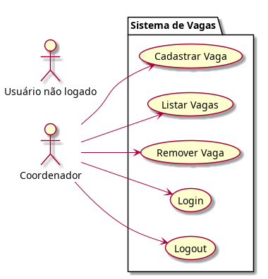
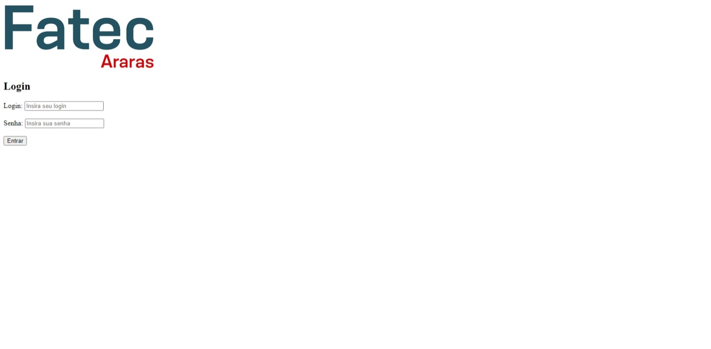
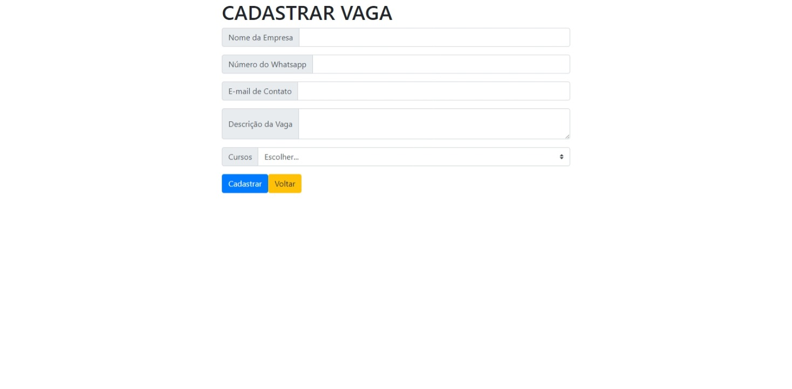
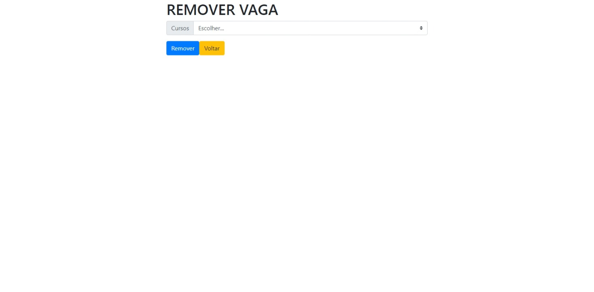
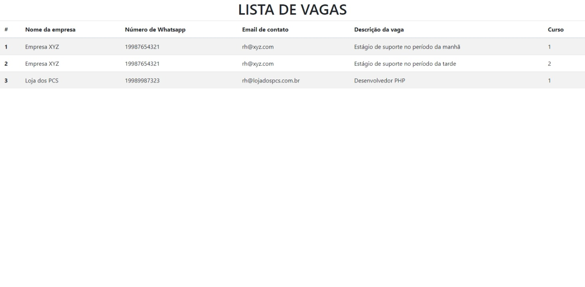

# FATEC_DES_WEB2_2024_Avaliacao2
Repositório da 2º prova de DW2

<h2>Descrição</h2>
Criar um sistema para controle de vagas que seja capaz de realizar todas as funções básicas de um CRUD.

<h2>Credenciais</h2>

  Usuario = estagio
  Senha = estagio

<h2>Funções</h2>

- [x] Realizar login
- [x] Realizar logout
- [x] Cadastrar vagas
- [x] Listar vagas
- [x] Remover vaga

<h2>Diagrama de Caso de Uso</h2>

<h2>Telas</h2>
<h3>Login</h3>

<h3>Menu</h3>

<h3>Cadastrar</h3>

<h3>Remover</h3>

<h3>Listar</h3>

